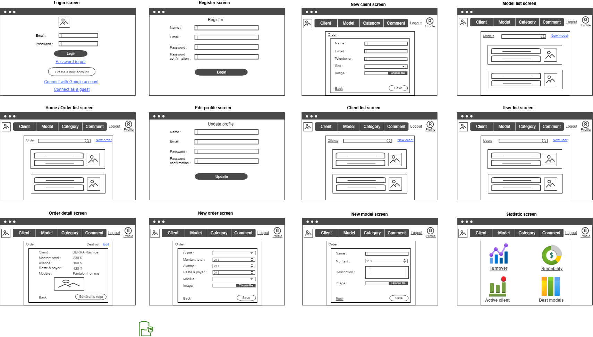
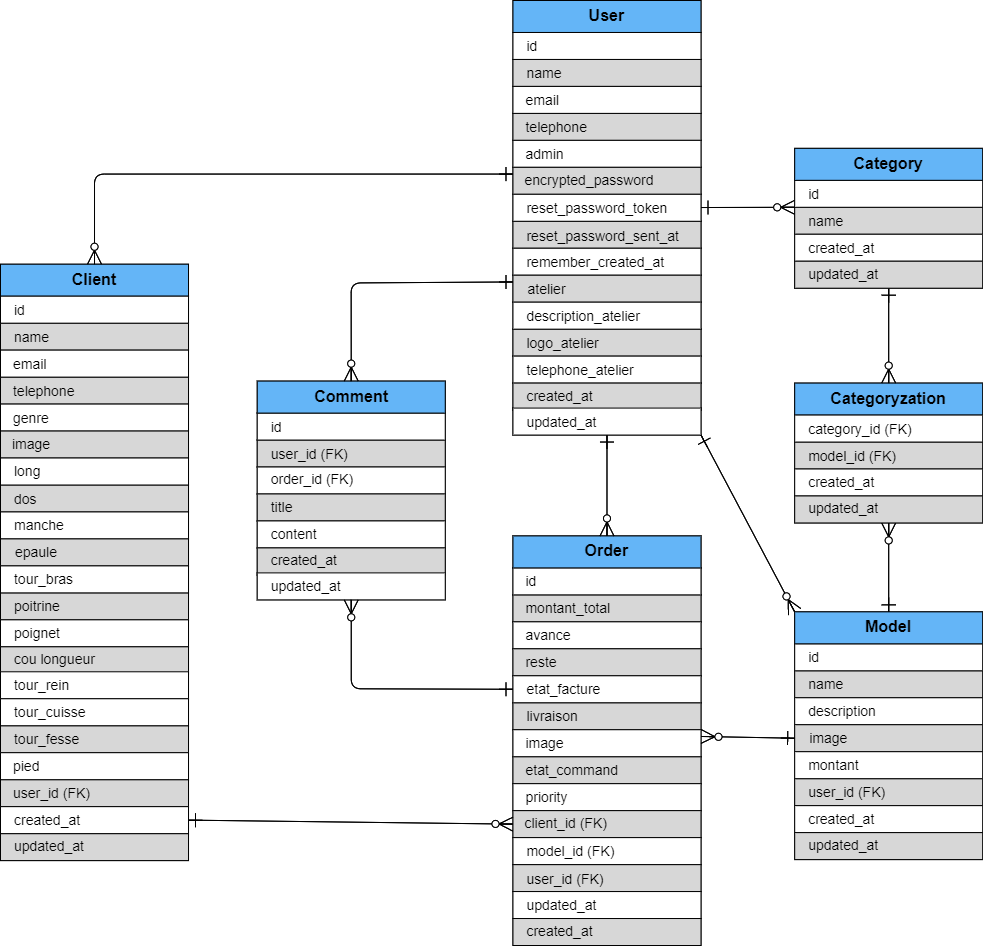
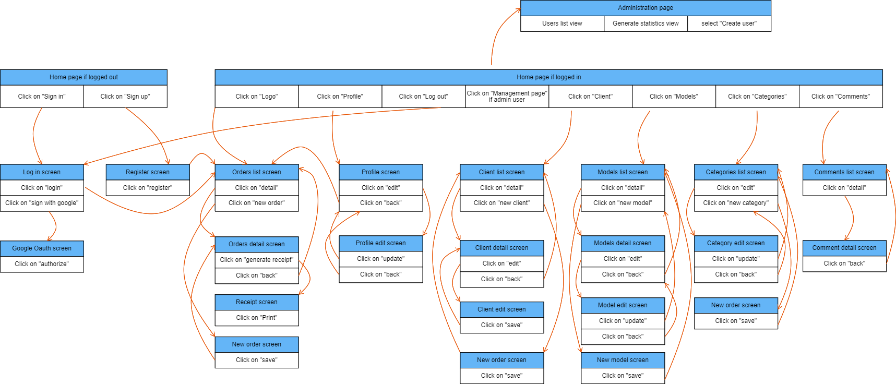

# README

This README would normally document whatever steps are necessary to get the
application up and running.

Things you may want to cover:

## Development Language

* Ruby 3.0.1
* Rails 6.0.3

## Employment Term Technology

- devise
- Comment function

## Technology outside the curriculum

- Chart.js

## Execution Procedure

>> $ git clone https://github.com/RachDerra/Couturex.git  
>> $ cd Couturex  
>> $ bundle install  
>> $ rails db:create  
>> $ rails db:migrate  
>> $ yarn add chart.js  
>> $ rails s  

## Check Sheet, Catalog Design and Table Definition Document

[Checksheet, Catalog Design, and Table Definition Share Link](https://docs.google.com/spreadsheets/d/1jlswKESigJrrl241Z7ZBpDHlPWVMRJVsXHVmNKAUTVw/edit?usp=sharing)

## Wireframe
[Wireframe](https://cacoo.com/diagrams/P3rLajnvxbVKeiwY/1A79C)

## ER Diagram
[ER Diagram](https://cacoo.com/diagrams/tLb1ojinQ2mjM22q/97BA0)

## Screen Transition Diagram
[Screen transition](https://cacoo.com/diagrams/L6OX92QXXzHkhcR3/4FF4D)

